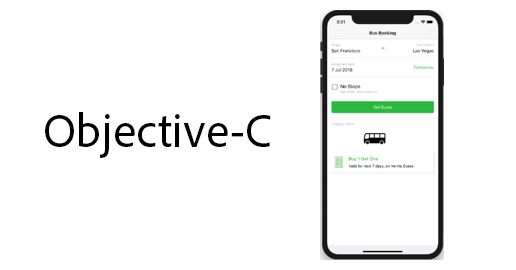

# Adobe Experience Platform Mobile SDK Tutorials

Tutorials and videos to help you master the Adobe Experience Platform Mobile SDK.

## What's New

* **[Understanding the Adobe Experience Platform Mobile SDK (Video)](fundamentals/understanding-the-mobile-sdks.md)**
    *Power end-to-end engagement in your mobile apps.*

* **[Implement the Adobe Experience Platform Mobile SDK in Android Apps (Tutorial)](https://experienceleague.adobe.com/docs/launch-learn/implementing-in-mobile-android-apps-with-launch/index.html)**
    *A step-by-step tutorial to learn how to implement the new mobile SDK in Android&trade; apps.*

## Staff Picks

<table>
<tr>
<td>
    
    

      <a href="https://experienceleague.adobe.com/docs/launch-learn/implementing-in-mobile-android-apps-with-launch/index.html">
    <strong>Implement in Android&trade; Apps</strong>
    </a>
    

    

    <em>Use Experience Platform Launch to implement the new mobile SDK in Android</em>
    

</td>
<td>
    
    

      <a href="https://experienceleague.adobe.com/docs/launch-learn/implementing-in-mobile-ios-objective-c-apps-with-launch/index.html">
    <strong>Implement in iOS Objective-C&trade; Apps</strong>
    </a>
    

    

    <em>Use Experience Platform Launch to implement the new mobile SDK in Objective-C</em>
    

  </td>
  <td>
    
    

      <a href="https://experienceleague.adobe.com/docs/launch-learn/implementing-in-mobile-ios-swift-apps-with-launch/index.html">
    <strong>Implement in iOS Swift&trade; Apps</strong>
    </a>
    

    

    <em>Use Experience Platform Launch to implement the new mobile SDK in Swift&trade;</em>
    

  </td>
</tr>
</table>

*Apple, the Apple logo, iPad, iPhone, iPod, and iPod touch are trademarks of Apple Inc., registered in the U.S. and other countries. Swift and the Swift logo are trademarks of Apple Inc.
Android is a trademark of Google LLC.*
